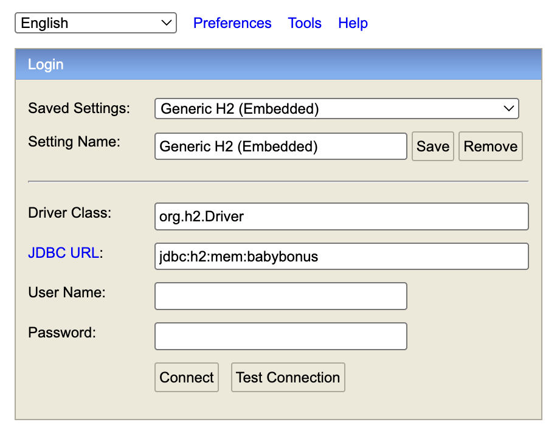
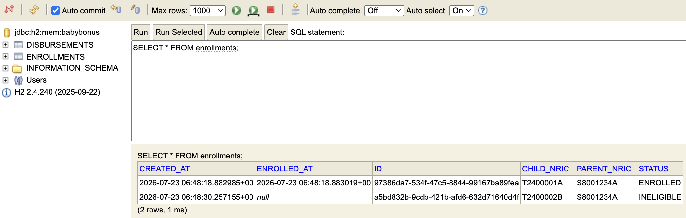
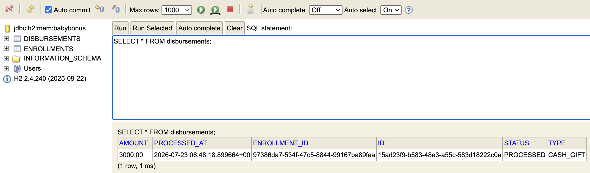

# Baby Bonus Enrollment Service

A Kotlin+Spring Boot backend service that handles Baby Bonus enrollment applications for newborns. 
It checks eligibility against mock ICA (child identity) and IROAS (parent identity) records, creates enrollment records, 
and initiates cash gift disbursement for eligible children.

Reference: https://www.madeforfamilies.gov.sg/support-measures/child-raising/financial-support/baby-bonus-scheme

Project Requirements can be found in the following directory: /docs/JUNIOR_BRIEF.md

The project directory structure is packaged by features, followed by the layer within each feature folder

Note: This is an assignment, not a real project.

---

## Tech Stack

- Kotlin
- Spring Boot
- H2 Database
- Gradle

IntelliJ IDEA was used for this project.

---

## Prerequisites

- JDK 17
- No external database needed as in-memory H2 is used

> If you don't have JDK 17 installed:
> - macOS (Homebrew): `brew install openjdk@17`
> - SDKMAN (cross-platform): `sdk install java 17.0.9-tem`

The project uses the Gradle wrapper (`./gradlew`), so no separate Gradle installation is required.

---

## How to Run

**Build and run the tests**

```bash
./gradlew build
```

**Run the tests only**

```bash
./gradlew test
```

**Run the service**

```bash
./gradlew bootRun
```

- The service will start on the default port `8080`
- On startup, it will load the mock data from `src/main/resources/mock-data/ica_children.json` and `iroas_parents.json` 
into in-memory stub clients, `StubIcaClient` and `StubIroasClient`

<br>

### Testing

Run all tests:

```bash
./gradlew test
```

Test reports are generated at /build/reports/tests/test/index.html, which can be viewed in the browser.

<br>

__Test Coverage__

| Layer	       | Test Class                                            | Covers                                                                                                                                                                                                                                                                                                                           |
|--------------|-------------------------------------------------------|----------------------------------------------------------------------------------------------------------------------------------------------------------------------------------------------------------------------------------------------------------------------------------------------------------------------------------|
| Controller   | 	EnrollmentControllerTest                             | HTTP-level request/response behavior for both POST and GET endpoints                                                                                                                                                                                                                                                             |
| Service      | 	EnrollmentServiceTest                                | Create Enrollment <br> - Eligible child → `ENROLLED` + disbursement `PROCESSED`<br>- Ineligible child → `INELIGIBLE`, no disbursement<br>- `ChildNotFoundException`<br>- `ParentNotFoundException`<br>- `DuplicateEnrollmentException`<br> Get Enrollment <br>- Masked NRIC in `GET` response<br>- `EnrollmentNotFoundException` |
| Integration  | 	EnrollmentIntegrationTest                            | End-to-end enrollment flow against the running Spring context                                                                                                                                                                                                                                                                    |
| Repository   | 	EnrollmentRepositoryTest, DisbursementRepositoryTest | JPA persistence behavior                                                                                                                                                                                                                                                                                                         |
| Stub Clients | 	StubIcaClientTest, StubIroasClientTest               | Mock-data loading and lookup by NRIC                                                                                                                                                                                                                                                                                             |
| Utilities    | JsonLoaderUtilTest, NricValidatorTest, DataMaskerTest | JSON loading, NRIC validation/normalization, NRIC masking logic                                                                                                                                                                                                                                                                  |

<br>

### API Endpoints
| Method | Path                       | Description                                         |
|--------|----------------------------|-----------------------------------------------------|
| `POST` | `/api/v1/enrollments`      | Submit an enrollment application                    |
| `GET`  | `/api/v1/enrollments/{id}` | Retrieve enrollment status and disbursement details |

<br>

### Sample curl Commands

#### Nominal Cases

__Eligible child (Singapore Citizen)__
1. Create an enrollment for eligible child

```bash
curl -i -X POST http://localhost:8080/api/v1/enrollments \
  -H "Content-Type: application/json" \
  -d '{
    "childNric": "T2400001A",
    "parentNric": "S8001234A"
  }'
```
Expected: `201 Created` with `{"enrollmentId": "<uuid>"}`


2. Get enrollment by ID

```bash
curl -i -X GET http://localhost:8080/api/v1/enrollments/{enrollmentId}
```
Expected: `200 OK` with masked NRIC, `ENROLLED` status, enrolledAt, and disbursement details

<br>

__Ineligible child (Permanent Resident or Foreigner)__
1. Create an enrollment

```bash
curl -i -X POST http://localhost:8080/api/v1/enrollments \
  -H "Content-Type: application/json" \
  -d '{
    "childNric": "T2400002B",
    "parentNric": "S8001234A"
  }'
```
Expected: `201 Created` with `{"enrollmentId": "<uuid>"}`


2. Get enrollment by ID

```bash
curl -i -X GET http://localhost:8080/api/v1/enrollments/{enrollmentId}
```
Expected: `200 OK` with masked NRIC, `INELIGIBLE` status, and `null` for enrolledAt and disbursement

<br>

#### Error Cases

__Unknown child NRIC__

```bash
curl -i -X POST http://localhost:8080/api/v1/enrollments \
  -H "Content-Type: application/json" \
  -d '{
    "childNric": "T1111111A",
    "parentNric": "S8001234A"
  }'
```
Expected: `404 Not Found` with message "Child not found"

<br>

__Unknown parent NRIC__

```bash
curl -i -X POST http://localhost:8080/api/v1/enrollments \
  -H "Content-Type: application/json" \
  -d '{
    "childNric": "T2400001A",
    "parentNric": "S1111111A"
  }'
```
Expected: `404 Not Found` with message "Parent not found"

<br>

__Invalid NRIC format (either child or parent)__

```bash
curl -i -X POST http://localhost:8080/api/v1/enrollments \
  -H "Content-Type: application/json" \
  -d '{
    "childNric": "T2401A",
    "parentNric": "S8001234A"
  }'
```
Expected: `400 Bad Request` with message "Invalid NRIC"

<br>

__Enrollment not found__
```bash
curl -i -X GET http://localhost:8080/api/v1/enrollments/12345678-1234-1234-1234-123456789012
```
Expected: `404 Not Found` with message "Enrollment not found"

<br>

__Duplicate enrollment__

Repeat an enrollment request for a child that already has an `ENROLLED` or `PENDING` enrollment
(does not apply to `INELIGIBLE` enrollments)

Expected: `409 Conflict` with message "Enrollment already exists"

---

## Database Query

To check that the data is saved properly in the database, you can do the following steps:

1. Run the service

```bash
./gradlew bootRun
```

2. Send some successful POST curl commands to create some enrollments. The sample curl commands that 
were provided in the earlier section for the nominal cases can be used

3. Go to http://localhost:8080/h2-console/, and you will see the following Login window:


4. Set the JDBC URL: `jdbc:h2:mem:babybonus`

5. For the user name and password, use the default values provided in the src/main/resources/application.yaml

6. Click `Connect`

7. In the next window, you can type the following SQL queries in the textbox and click `Run` to check the data that were stored in the database. 
The query result will be displayed below the textbox

__SQL query for all enrollments in the enrollments table__



__SQL query for all disbursements in the disbursements table__



8. Verify that the enrollment created for an ELIGIBLE child has the corresponding disbursement row created. 
Likewise, the enrollment created for an INELIGIBLE child should not have any disbursement row created for them


__Set up credentials for the database__

To secure your database, you can override the H2 console credentials by creating a file called 
`.env` in the project root containing the environment variables `DB_USERNAME` and `DB_PASSWORD` set to your own credentials. 
Then, load the environment variables before running the service. The `.env` has also been added to `.gitignore` to ensure the 
new credentials will not accidentally be push to the git repository.

1. For example, let's say the new username and password are set to `hello` and `world` in the .env:
```bash
DB_USERNAME=hello
DB_PASSWORD=world
```

2. Next, run the following commands to load the variables from `.env` as environment variables and start the service:
```bash
set -a; source .env; set +a
./gradlew bootRun
```

3. Now, in the h2-console login window, you should be able to log in with your new credentials.

---

## Assumptions Made

- When a child or parent is not found in the ICA/IROAS mock records, the verification step throws an exception rather than silently failing


- Enrollment records are created **regardless** of eligibility outcome (including `INELIGIBLE`), to preserve an audit trail


- Enrollment is only rejected outright when the child/parent NRIC doesn't exist, either of their NRIC is of invalid format, or a duplicate active enrollment exists


- For an `INELIGIBLE` enrollment, the `disbursement` field in the GET response is `null`


- A new enrollment is considered duplicate only if there exists an existing enrollment for the same child with the status `ENROLLED` or `PENDING`. 
An `INELIGIBLE` enrollment does not block re-enrollment (e.g. a child who becomes Singapore Citizen later can be enrolled again assuming they meet the conditions given in the Baby Bonus scheme)


- Upon successful enrollment, both the enrollment and its cash gift disbursement are marked `PROCESSED` immediately


- NRICs are stored in their **unmasked** form in the Enrollment record since other internal services may require the full NRIC; masking is only applied on the `GET` API response, not in storage


- There is currently no explicit relationship linking a specific parent to a specific child; any parent NRIC in the mock IROAS data can be used to enroll any child NRIC in the mock ICA data


---

## What I Would Do Next

- **Link parent-child relationship**: currently there is no field connecting a child to their actual parent/guardian, 
so any parent can enroll any child. This should be validated against a real relationship data source


- **Implement `CDA_DEPOSIT` disbursement type**: only `CASH_GIFT` is currently wired up


- **Support ongoing `CDA_DEPOSIT` and multiple disbursements**: the `EnrollmentGetResponse` currently returns a single `Disbursement`, 
but in reality a child could receive CDA top-ups over multiple years. This should become a list of disbursements


- **Implement multiple `CASH_GIFT` disbursements**: in the baby bonus scheme, multiple `CASH_GIFT` of various amounts will be given over the span of an eligible child's life
(e.g. `at birth: $3000`, `6 months: $1500`, `12 months: $1500`, etc.)


- **Encrypt NRIC at rest**: NRIC is currently stored in plaintext in the H2 database; given its sensitivity, this should be encrypted in the database
rather than relying solely on masking at the API boundary


- **Add authentication/authorization**: no auth is currently implemented to secure the API endpoints; endpoints are open for access to anyone

